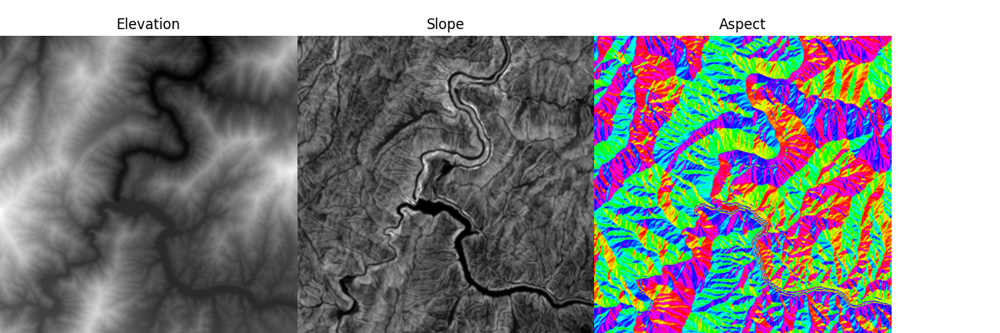
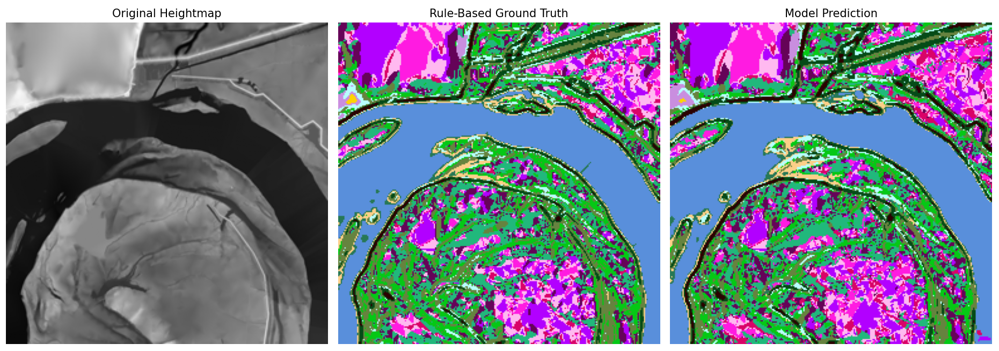
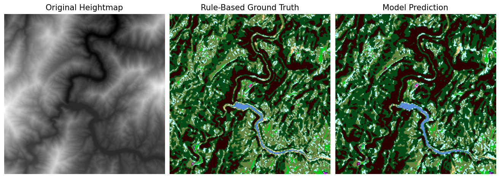
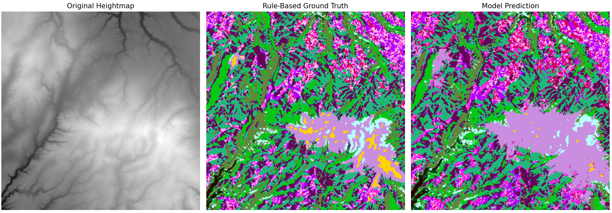

# Heightmap Terrain Classification AI

Author: Ethan Mullins  
Class: CS 470

---
# Abstract
This project explores the application of deep learning for terrain segmentation using synthetically generated labels derived from heightmap features. The study introduces a preprocessing pipeline that computes elevation, slope, and aspect from real heightmap data, followed by a rule-based classifier that assigns land-use categories relevant to agricultural and ecological planning. A U-Net convolutional neural network is trained on these features using a combination of weighted cross-entropy loss and Dice loss to address class imbalance. The model is evaluated on an unseen test set, producing segmentation outputs that are compared visually and quantitatively against the rule-based ground truth. Results show that the U-Net learns meaningful spatial patterns from the handcrafted rules, demonstrating moderate to strong agreement depending on label frequency. This project highlights how synthetic labels can bootstrap segmentation models in domains where real annotations are costly.

# 1. Introduction

Terrain analysis plays a crucial role in agriculture, forestry, hydrology, and ecological land-use planning. Traditional geographic information systems (GIS) rely heavily on manual annotation or expert-driven classification, which is time-consuming and expensive. The goal of this project is to automate terrain classification using deep learning, specifically a U-Net architecture, trained on labels generated from a custom rule-based system.  
This approach eliminates the need for manual data labeling while providing a repeatable and scalable preprocessing pipeline. The central research question explored in this project is:

**Can a deep learning model learn meaningful segmentation from synthetic rule-derived terrain labels?**

# 2. Methodologies

Each heightmap undergoes a multi-stage preprocessing pipeline that converts raw elevation values into a structured, multi-channel representation suitable for training a segmentation model. This process is handled primarily by the functions `process_heightmap_features()`, `process_heightmap_labels()`, and the `TerrainDataset` class.

## 2.1. Feature Extraction

For every image, the system first loads and resizes the heightmap to a fixed 256 × 256 resolution. The function `process_heightmap_features()` computes four core feature channels:

**1. Normalized Elevation**  
Raw 16-bit elevation values are min-max normalized to the range [0, 1].
   
**2. Smoothed Slope**    
* Gradients are calculated using `np.gradient`
* Slope magnitude is computed as:
    - √((δx)² + (δy)²)
* A 3x3 mean filter (`scipy.ndimage.convolve`) smooths local noise.
* The smoothed slope is normalized to [0, 1].

**3. Aspect (Sin and Cos components)**  
Aspect (0-360°) is derived using arctan2 and converted to radians. To avoid angular discontinuities in training, aspect is encoded as:  
* aspect_sin = sin(aspect)
* aspect_cos = cos(aspect)

The output of this step is a 4-channel tensor representing:  
* `[elevation, slope, aspect_sin, aspect_cos]`

## 2.2. Rule-Based Labels  

A deterministic classifier `classify_pixel()` assigns each pixel to one of sixteen land-use categories based on:  
* **Elevation zone:** Low, Mid, High
* **Aspect Category:** North, North-East, East, etc
* **Slope range** (ex. 0.18)  
These rules mimic ecological/agricultural reasoning, such as placing wetlands in low-flat zones or orchards on mid-slope north/south aspects. Based on these terrain attributes, the function assigns one of **16 agricultural land-use classes** (`pond_wetland`, `forest`, `unsuitable`, etc.) The helper `process_heightmap_labels()` applies this rule system over all pixels in the heightmap and constructs a **256 × 256 integer label map**, where each class corresponds to an index defined in label_to_idx

## 2.3. Dataset Construction

The `TerrainDataset` class integrates the feature and label generation processes to produce training-ready samples:  
* The constructor loads all .png heightmaps from a directory.
* `__getitem__()`:
    - Generates the 4-channel feature tensor using `process_heightmap_features()`.
    - Computes the corresponding label mask using `process_heightmap_labels()`.
    - Converts both arrays into PyTorch tensors.

Each sample returned has the form:  
`image_tensor`: torch.float32 shape (4, 256, 256)  
`label_tensor`: torch.long shape (256, 256)

This structured dataset is then fed into a DataLoader for batching, shuffling, and iteration during training.

## 2.4. Model Architecture

The segmentation model used in this project is a custom U-Net designed to predict per-pixel land-use classifications from processed heightmap features. The network follows the classic encoder–decoder structure with skip connections but is adapted to the specific characteristics of the dataset and the four-channel input representation (elevation, slope, aspect sine, and aspect cosine).

### Encoder

The encoder extracts spatial and contextual features through a series of convolutional blocks and downsampling steps. Each block uses a **3×3 convolution → BatchNorm → ReLU** (CBR). Three encoding stages are used:  
1. **enc1**:  
a. Input: 4 channels  
b. Output: 32-channel low-level features  
c. Captures edges, elevation contours, and slope transitions.

2. **enc2**:  
a. Input: pooled enc1 features  
b. Output: 64 channels  
c. Captures terrain structure, broad slope variations, and aspect transitions.

3. **enc3**:  
a. Input: pooled enc2 features  
b. Output: 128 channels  
c. Captures global context and higher-level relationships between terrain features.

Downsampling is performed using `MaxPool2d(2)` after enc1 and enc2, reducing spatial resolution by half each time.

### Decoder

The decoder reconstructs pixel-level predictions from deep encoder features while restoring spatial resolution. It uses bilinear upsampling followed by skip connections:

1. **d2**:  
a. Input: upsampled enc3 (128 channels) concatenated with enc2 (64 channels)  
b. Output: 64-channel feature map  
c. Restores mid-level details lost during downsampling.

3. **d1**:  
a. Input: upsampled d2 (64 channels) concatenated with enc1 (32 channels)  
b. Output: 32-channel feature map  
c. Reintroduces fine spatial information such as small ridges and localized aspect patterns.

Final spatial resolution matches the original 256×256 heightmap.

### Output Layer

A final 1×1 convolution maps the 32-channel decoder output into:  
- num_classes = 16

Each pixel receives a vector of logits representing the class probabilities for the 16 land-use categories generated by the synthetic rule system

### Loss & Optimization
* Training uses a hybrid loss:
   - Weighted Cross-Entropy Loss to handle class imbalance
   - Dice Loss to improve segmentation quality for rare classes
+ The model is optimized using the Adam optimizer

Each pixel receives a vector of logits representing the class probabilities for the 16 land-use categories generated by your synthetic rule system.

### Architectural Summary:
|Stage   |Operation   |Output Channels   |Resolution   |
| ------------ | ------------ | ------------ | ------------ |
|enc1   |  CBR | 32  | 256 |
|pool   |MaxPool  | 32  |256 → 128   |
| enc2  | CBR  | 64  | 128  |
| pool  | MaxPool  | 64  | 128 → 64   |
| enc3  |  CBR |   128|  64 |
|  up |  Upsample |128   |64 → 128   |
| dec2  |  CBR | 64  |12   |
| up  |  Upsample |64   |128 → 256   |
| dec1  |  CBR | 32  |256   |
|  final | 1 x 1 conv  | 16  | 256  |

### Design Rationale
The U-Net architecture is well-suited for this task because:  
- Terrain classification is spatial and benefits from multi-scale feature extraction.
- Skip connections preserve fine-grained features, important for capturing subtle slope or aspect changes.
- Bilinear upsampling avoids checkerboard artifacts.
- Four feature channels encode rich geomorphological information beyond raw elevation.

This architecture provides a balance between computational efficiency and segmentation performance, making it effective for rule-based terrain-label emulation.

## 2.5. Visualization Pipeline

To qualitatively assess model performance, a full visualization pipeline is implemented. For each image in the test dataset, the `visualize_prediction` function renders three aligned outputs:  
1. Original Heightmap (grayscale).
2. Rule-Based Ground Truth (generated by classify_pixel).  
3. Model Prediction (argmax across U-Net channels).

Each classification map is converted to color using an RGB palette defined for all 16 classes. This allows human-readable side-by-side inspection of:  
- Label boundaries  
- Terrain category transitions  
- Model errors or successes  
- Whether the U-Net matches the terrain rules

The visualization facilitates interpretation of how well the U-Net has learned the underlying rule-based mapping, particularly on complex features such as slopes, south-facing aspects, and erosion-prone steep zones. This qualitative analysis complements the numerical metrics.

## 2.6. Evaluation Metrics

After training, the trained model is evaluated using a separate test set of heightmaps. Evaluation is performed pixel-wise and includes both accuracy-based and F1-based metrics.
### Per-Class Accuracy
For each of the 16 terrain categories, the following quantities are computed:  
- Total number of ground-truth pixels  
- Correct predictions (matching predicted class)  
- Per-class accuracy

This is especially important for terrain maps with heavy class imbalance (e.g., “forest” appearing far more often than “riparian buffer”).

### Overall Pixel Accuracy
The percentage of correctly classified pixels across the entire test set.
### Macro F1 Score
Treats all classes equally, regardless of frequency. Useful for determining if rare classes are well-learned.
### Weighted F1 Score
Weighs each class by the number of ground-truth pixels. Better reflects real-world performance on imbalanced terrain.

These metrics provide a balanced assessment of how well the model captures terrain semantics and reproduces the rule-based structure.

# 3. Dataset
The dataset used in this project is based on real-world terrain heightmaps generated via the web tool UnrealHeightmap. This provides an externally sourced, standardized collection of terrain height data, converted to a format suitable for segmentation analysis.

## 3.1. Heightmap Source
Heightmaps were obtained using UnrealHeightmap (a browser-based generator that exports 16-bit grayscale PNG files derived from global elevation data.  
[manticorp/unrealheightmap](https://github.com/manticorp/unrealheightmap)

## 3.2. Dataset Split
- The training set (61 images) provides diverse terrain examples across elevation, slope, and aspect variation to help the model learn generalizable patterns.
- The testing set (from a held-out subset of the 61 images & some extra) is used solely for evaluation — both quantitative (accuracy, F1, per-class metrics) and qualitative (visualization of model predictions vs rule-based ground truth).
## 3.3. Benefits & Limitations
### Benefits
- The 16-bit elevation maps from UnrealHeightmap give high-fidelity terrain data, preserving subtle gradations in height.
- Using real-world elevation data ensures naturalistic terrain structure (mountains, valleys, slopes) rather than purely noise-based or artificially generated terrain.
- Automatic label generation via terrain-rule logic avoids labor-intensive manual annotation.
- Consistent preprocessing (resize, normalization) and uniform dataset formatting facilitate reproducibility and allow direct use in deep learning pipelines.
### Limitations / Considerations
- While the heightmaps derive from real-world data, the rule-based classifier abstracts terrain into discrete land-use classes which may not correspond to actual land cover; this serves as a synthetic “ground truth.”
- Some terrain features (very fine resolution detail, micro-topography) may be lost or smoothed during conversion/resizing to 256×256, potentially reducing realism.
- Class imbalance: certain terrain categories (“forest” or “slopes”) may dominate, while others (“riparian_buffer,” “windbreak”) occur sparsely. This must be accounted for during training (class weighting) and evaluation.

# 4. Results
## 4.1. Visual Comparison
Qualitatively, the trained U-Net model successfully learns the spatial patterns embedded in the synthetic rule-based classifier. Across most test images, predictions capture the large-scale terrain structures such as:  
- flat upland regions classified as **building/solar**,
- mid-slope agricultural zones (e.g., annuals_south, annuals_open),
- steep gradients transitioning into **windbreak, silvopasture, or forest zones**.

Visual comparisons between the **rule-based ground truth** and the **model predictions** show that the network is particularly good at reproducing broad, contiguous regions. The skip connections in the U-Net allow the model to preserve fine boundaries between classes, especially in mid-slope perennial and orchard regions where slight elevation or slope changes alter classification.  

However, the model struggles in two specific situations:
1. **Boundary Transitions**:  
   Thin contour-based classes (e.g., perennials_contour or erosion_control) sometimes appear “thicker” or “blurred” in predictions because the network smooths spatial edges during decoding.
2. **Rare Classes**:  
   Classes with small spatial presence (e.g., pond_wetland, unsuitable) are occasionally misclassified into visually similar categories. Even with inverse-frequency class weighting, the network sees very few pixels of these categories and cannot fully learn their patterns.

Overall, visual inspection confirms that the network captures the underlying topographical rules reasonably well and approximates the synthetic labeling function with good spatial fidelity.

## 4.2. Quantitative Evaluation
After 80 epochs, the model achieved:  
- F1 Macro: 0.71
- F1 Weighted: 0.77

These values indicate that while performance is strong on majority and highly distinguishable classes, minority or visually ambiguous classes reduce the macro score.

### Top 3 Performing Classes
| Class  |Accuracy   |Reasoning   |
| ------------ | ------------ | ------------ |
|Unsuitable|99.60%|Extremely common in the training set. Distinct regions (very steep slopes) make this class easy for the model to identify|
|Perennials Hillside|98.27%|Strong slope geometry creates consistent visual patterns that the model can reliably detect.|
|Annuals South|95.62%|Clear southern aspect with moderate slope gives a recognizable signature in the heightmaps.|

### Bottom 3 Performing Classes
| Class  |Accuracy   |Reasoning   |
| ------------ | ------------ | ------------ |
|Building / Solar|9.42%|Highly ambiguous terrain; overlapping geometric features and low representation make learning difficult.|
|Annuals Open|55.97%|Flat or featureless terrain has weaker patterns, reducing separability.|
|Silvopasture|64.75%|Mixed-use land blends several terrain traits, making classification more complex.|

# 5. Conclusion
This project demonstrates that a U-Net segmentation model can effectively learn and reproduce a complex, multi-rule agricultural land-classification system derived from synthetic heightmap features. Using only elevation, smoothed slope, and trigonometric aspect channels, the model achieved strong performance, with a 0.71 macro F1-score and 0.77 weighted F1-score after 80 epochs of training.

The model excels at identifying large, contiguous land-use regions such as forest, windbreak, annuals, and hillside perennial zones. While rare classes remain challenging, the network still learns the majority of rule relationships and generalizes them to unseen heightmaps.

Beyond this project, the pipeline establishes a reusable methodology for:

- generating large labeled datasets from unlabeled terrain,
- training segmentation networks on topographic or rule-derived features,
- and evaluating how well machine learning models can approximate expert-designed environmental rules.

**Future work could include:**  
- adding more heightmap diversity,
- augmenting the dataset with rotations or noise,
- Incorporating GIS mapping API to get real map data for the AI. This allows for the most accurate means of evaluation with relative elevations.

Overall, the project successfully demonstrates end-to-end terrain classification from raw heightmaps, validating both the feature engineering pipeline and the learning capability of the U-Net model.
